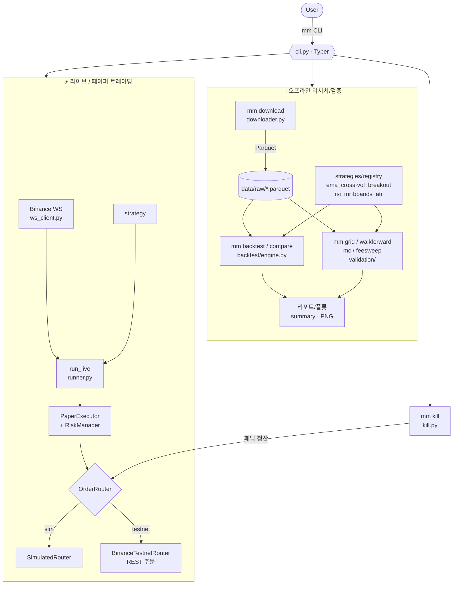
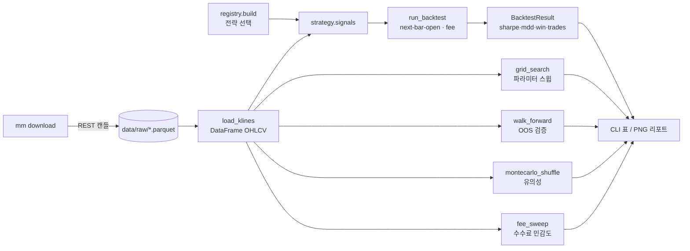
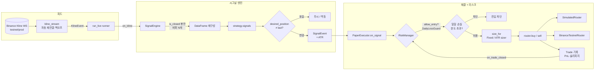
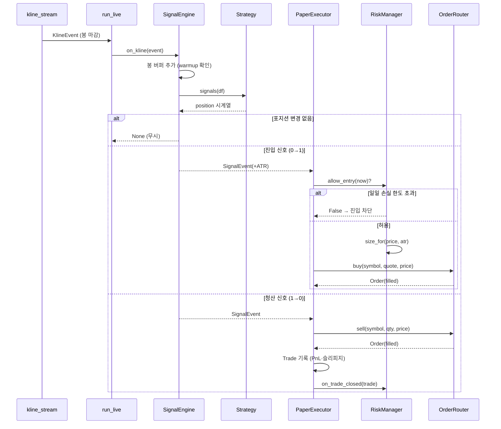
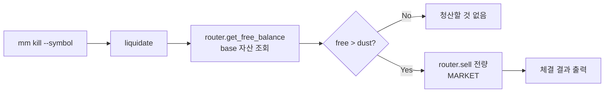

# 서비스 플로우

money-maker는 CLI(`mm`) 하나로 **오프라인 리서치/검증**과 **라이브/페이퍼 트레이딩** 두 파이프라인을 묶습니다. 이 문서는 각 플로우를 Mermaid 다이어그램으로 정리합니다.

> 코드 기준: Stage 5 (리스크 매니저 포함). 백테스트 → 검증 → Testnet 페이퍼까지 동작.

## 1. 전체 개요

## 2. 오프라인 리서치 플로우

`download` → 전략 시그널 → 백테스트 → (선택) 검증. 모두 네트워크 의존이 없고(`download` 제외) 재현 가능합니다.

| 명령 | 모듈 | 산출물 |
|------|------|--------|
| `mm backtest` | `backtest/engine.py` | 단일 성과 요약 + 선택적 PNG |
| `mm compare` | `backtest/engine.py` | 전 전략 비교 표 |
| `mm grid` | `validation/sensitivity.py` | Sharpe 상위 파라미터 조합 |
| `mm walkforward` | `validation/walkforward.py` | 롤링 윈도우 OOS Sharpe |
| `mm mc` | `validation/montecarlo.py` | 수익률 셔플 분포 대비 관측값 |
| `mm feesweep` | `validation/fees.py` | 수수료 레벨별 성과 |

## 3. 라이브 트레이딩 파이프라인

WS 피드 → 시그널 엔진 → 페이퍼 체결 → 라우터. 리스크 매니저(사이저 + 일일 손실 컷)가 항상 진입 경로에 끼어듭니다.

## 4. 시그널 → 주문 시퀀스 (한 사이클)

## 5. 킬스위치 플로우

`mm kill`은 봇의 in-memory 상태가 아니라 **거래소 잔고**를 조회해 전량 시장가 청산합니다. 러너 가동 여부와 무관한 패닉 버튼입니다.

## 6. 핵심 설계 포인트

- **멱등성 이중 방어** — `SignalEngine`이 포지션 변화 시에만 이벤트를 내보내고, `PaperExecutor`가 다시 현재 포지션과 비교해 중복 주문을 막습니다. (REST 폴링·리플레이 같은 미래 입력 소스 대비)
- **라우터 추상화** — `OrderRouter` 프로토콜로 `SimulatedRouter`(네트워크 없음)와 `BinanceTestnetRouter`(실제 REST)를 동일 인터페이스로 교체 (`--router sim|testnet`).
- **리스크 관리 분리** — `PositionSizer`(Fixed/ATR) + `DailyLossGuard`를 `RiskManager`가 합성. 순수·동기 함수라 이벤트 루프/클럭 없이 단위 테스트 가능.
- **킬스위치 독립성** — 거래소 잔고 기준 청산이라 러너가 죽어도 동작. 러너는 별도로 Ctrl-C로 종료.
- **Look-ahead 차단** — 백테스트는 next-bar-open 체결 + `shift`로 미래 정보 누수를 막고, 라이브는 `is_closed` 봉만 처리.
- **Testnet 우선** — `BINANCE_TESTNET=true`가 기본값. 실거래 코드는 항상 Testnet에서 먼저 검증.

## 관련 문서

- [01-architecture.md](01-architecture.md) — 레이어 구조, 의존 방향
- [02-modules.md](02-modules.md) — 파일별 책임
- [03-workflow.md](03-workflow.md) — 셋업·일상 흐름
- [04-roadmap.md](04-roadmap.md) — 마일스톤
